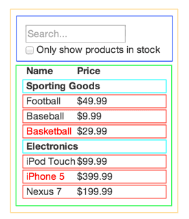

import { Head } from 'mdx-deck';
import ReactLogo from './src/ReactLogo';

<Head>
    <title>React.js Basics</title>
</Head>

<ReactLogo />

```notes
Front-end JavaScript library created by Facebook, open sourced 2013
Unifies presentation with logic
```

---

import { Appear } from 'mdx-deck';

# Why doe?

<ul>
    <Appear>
        <li>Virtual DOM</li>
        <li>Reusable Web Components</li>
        <li>The Community</li>
        <li>Plays Nice With Others</li>
    </Appear>
</ul>

```notes
- Virtual DOM updates only the specified target
- Manageable, reusable, scalable, overwrite-able
- Widely popular, lots of support
- Works with Kendo; Laravel even has a preset for React
```

---

import Survey from './src/Survey';

<Survey />

---

import JSX from './src/JSX';
import JS from './src/JS';

## JSX vs HTML & JS

<ul>
    <Appear>
        <span><JS /></span>
        <span><JSX /></span>
    </Appear>
</ul>

```notes
- Writes like html but is NOT html
- A lot cleaner
- Allows us to use JavaScript expressions
```

---

## Your first component

  

```notes
- Everything is scoped
- Functional and Class components
- Naming conventions
```

---

  


import SimpleBtnWrapper from './src/SimpleBtnWrapper';

<SimpleBtnWrapper />

```notes
- Descriptive names
- Cleans up structure
- Makes it more manageable
```

---

import SimpleBtn from './src/SimpleBtn';

## Props


```notes
- Explain props before code example
```

---

## Props continued...


<ul>
    <Appear>
        <span>
            <SimpleBtn 
                color="firebrickred"
                backgroundColor="papayawhip"
                text="Click meh" />
        </span>
        <span>
            <SimpleBtn 
                color="white"
                backgroundColor="dodgerblue"
                text="wassssssup" />
        </span>
        <span>
            <SimpleBtn 
                color="purple"
                backgroundColor="orange"
                text="i iz a btn yo" />
        </span>
        <span>
            <SimpleBtn 
                color="white"
                backgroundColor="limegreen"
                text="still a btn" />
        </span>
        <span>
            <SimpleBtn 
                color="gold"
                backgroundColor="lightslategray"
                text="yup...btn" />
        </span>
    </Appear>
</ul>

```notes
- Could even include a function to create as many SimpleBtns as needed
```

---

# Props vs. State

```notes
- Props are like function params, passing to comps
- State is managed within the comp that is declaring it, think of a local variable
```

---

import Counter from './src/Counter';

## State


<Counter />

```notes
- If it has state, it's a class...for now
- Constructor? Binding?
- You don't "update" state, you "replace" it
- React catches state changes and update VDOM
- PrevState
- Notice the brackets in JSX
```

---

## Thinking In React
Don't get overwhelmed, you can always break things down as you go.



---

## Keep Going!

[Free React Tutorial](https://scrimba.com/g/glearnreact)  

[React.js](https://reactjs.org/)  

[Wes Bos React Tutorial](https://reactforbeginners.com/)

---

